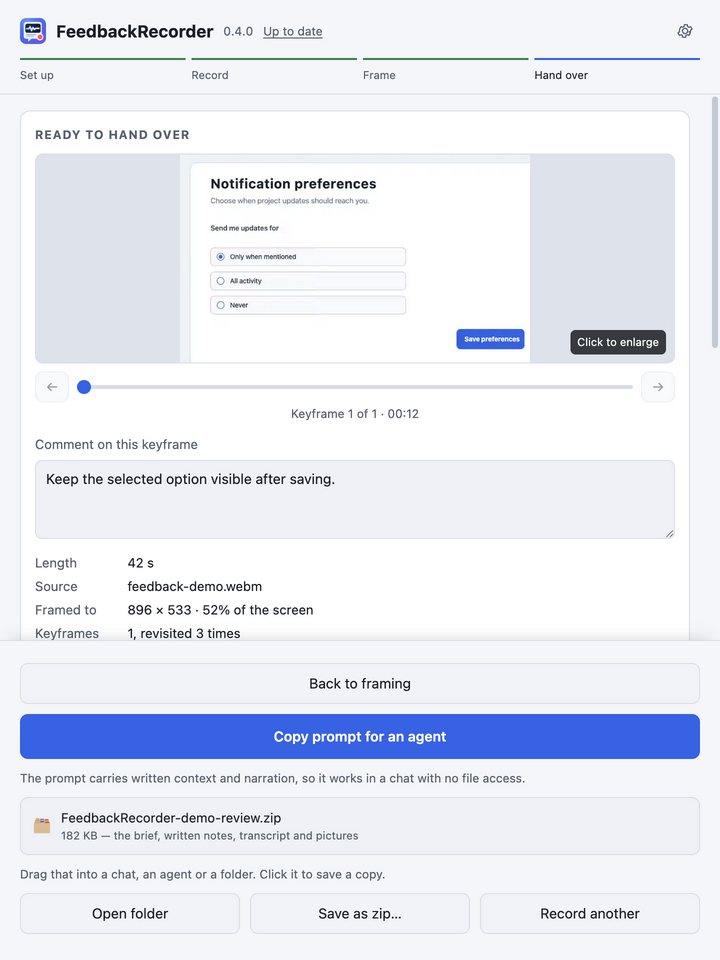
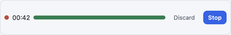
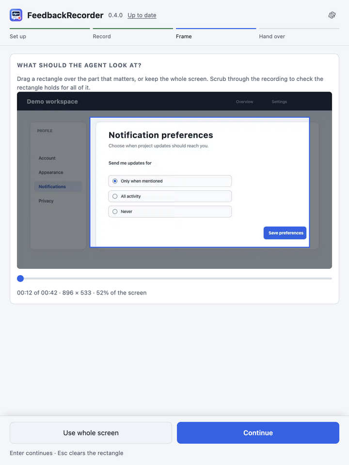

<p align="center">
  
</p>

# FeedbackRecorder

**Turn a screen walkthrough into an agent-ready brief with narration, keyframes, written comments, and input chronology.**

For Windows 10/11, macOS on Apple Silicon or Intel, and x86-64 Linux.

**[Download the latest release](https://github.com/magnuslandahl/FeedbackRecorder/releases/latest)** · about 1 GB because local speech recognition is included

[](https://github.com/magnuslandahl/FeedbackRecorder/actions/workflows/ci.yml)

[Latest release](https://github.com/magnuslandahl/FeedbackRecorder/releases/latest) ·
[MIT license](LICENSE) ·
[CodeQL and security](https://github.com/magnuslandahl/FeedbackRecorder/security) ·
[Checksums](https://github.com/magnuslandahl/FeedbackRecorder/releases/latest/download/SHA256SUMS.txt) ·
[Artifact attestations](https://github.com/magnuslandahl/FeedbackRecorder/attestations) ·
[Report a vulnerability privately](https://github.com/magnuslandahl/FeedbackRecorder/security/advisories/new)

<p align="center">
  
</p>

## Show the problem, not a reconstruction of it

FeedbackRecorder keeps the evidence and the explanation together:

- give a coding agent your narration, the relevant visuals, written notes, and a
  privacy-filtered chronology of clicks and keyboard activity;
- catch meaningful small changes such as a menu or dialog without producing
  screenshot spam;
- work by voice, by comments attached to individual keyframes, or with written
  instructions only;
- capture, transcribe, select frames, and store the package locally, then
  explicitly choose whether to paste a prompt or export a zip.

The app contacts GitHub for update metadata and for a release download only when
you choose to update. You choose where to paste or export the result. The default
zip excludes the raw video and your recorded voice, but it still contains
sensitive context and must be inspected before sharing. See [Privacy](docs/PRIVACY.md)
for the exact data flow.

## Quick start

1. [Download and install](#installing) the build for your platform.
2. Record a screen or import a video, then frame the region the agent should
   inspect.
3. Review the keyframes, add comments if useful, then **Copy prompt for an
   agent** or share the prepared zip.

New here? Follow [Getting started](docs/GETTING_STARTED.md) for the complete
first handoff.

## Visual workflow

### Record without covering the work

The main window moves away and leaves a compact controller with elapsed time,
microphone level, discard, and stop controls.

<p align="center">
  
</p>

### Frame only what matters

Drag over the stable region the agent should inspect, then scrub through the
video to confirm the frame still fits.

<p align="center">
  
</p>

### Review, annotate, and hand over

Keyframes can be enlarged and annotated. The copied prompt carries the written
context, narration, visual references, and input chronology together.

<p align="center">
  
</p>

## Features

**Capture**

- Record a display, or an app window on macOS, with optional microphone narration.
- Import an existing video instead of recording.
- Use a compact controller and a global stop shortcut while recording.

**Context**

- Transcribe narration locally in a selected language or with automatic detection.
- Select keyframes when the screen meaningfully changes and identify revisits
  without saving duplicate images.
- Frame and reframe the relevant region, enlarge keyframes, and attach per-frame
  comments or general written instructions.
- On macOS, optionally timestamp clicks, scrolling, shortcuts, navigation keys,
  and counts of ordinary typing; typed characters are not stored.

**Handoff**

- Copy a self-contained prompt for an agent.
- Drag or save a zip containing the brief, transcript, screenshots, notes, input
  chronology, and `run.json`.
- Add raw video and narration audio only when explicitly selected.

**Cross-platform, appearance, and updates**

- Windows 10/11, macOS on Apple Silicon and Intel, and x86-64 Linux.
- Light, dark, or system appearance.
- Update checks use GitHub release metadata; installer downloads start only after
  confirmation and are checksum-verified before use.

**Privacy**

- Capture, transcription, keyframe extraction, notes, and input activity are
  processed and stored locally.
- No account, advertising, analytics, or telemetry.
- The default location avoids known cloud-sync roots when possible and warns
  when a selected folder appears synchronized.
- Exports remain sensitive: screenshots, transcripts, notes, input chronology,
  and `run.json` can expose private content or local paths.

## Trust and verification

FeedbackRecorder is [open source](LICENSE), and `main` is protected by pull
request checks. CI includes tests on supported operating systems, Gitleaks and
secret scanning, dependency review, and separate CodeQL analysis. Those controls
reduce risk; they do not prove that the software has no vulnerabilities.

Build-time vendor inputs use immutable revisions plus expected sizes and SHA-256
digests. Releases include
[`SHA256SUMS.txt`](https://github.com/magnuslandahl/FeedbackRecorder/releases/latest/download/SHA256SUMS.txt)
and GitHub artifact attestations:

```bash
gh attestation verify <downloaded-file> -R magnuslandahl/FeedbackRecorder
```

See [Shipped components](docs/SHIPPED_COMPONENTS.md) for bundled dependencies
and [report vulnerabilities privately](https://github.com/magnuslandahl/FeedbackRecorder/security/advisories/new).

**Current installers are unsigned on Windows and are not Developer ID signed or
notarized on macOS.** Operating systems therefore show first-run warnings, and
managed devices may block installation. Checksums and attestations verify bytes
and GitHub build provenance; they do not replace platform signing. See
[Code signing and notarization](docs/SIGNING.md).

## Installing

Choose the build for your platform. The download is about 1 GB because it
includes the speech-recognition model used for local transcription.

| Platform | Download | First launch |
| --- | --- | --- |
| **Windows 10 or 11, x64** | [FeedbackRecorder-Windows-x64-Setup.exe](https://github.com/magnuslandahl/FeedbackRecorder/releases/latest/download/FeedbackRecorder-Windows-x64-Setup.exe) | Open the installer. At **Windows protected your PC**, choose **More info → Run anyway**, then finish setup. |
| **Mac, Apple Silicon** (M1 or newer) | [FeedbackRecorder-macOS-arm64.dmg](https://github.com/magnuslandahl/FeedbackRecorder/releases/latest/download/FeedbackRecorder-macOS-arm64.dmg) | Drag the app to Applications, try to open it once, choose **Done**, then use **System Settings → Privacy & Security → Open Anyway → Open**. |
| **Mac, Intel** | [FeedbackRecorder-macOS-x64.dmg](https://github.com/magnuslandahl/FeedbackRecorder/releases/latest/download/FeedbackRecorder-macOS-x64.dmg) | Use the same **Privacy & Security → Open Anyway** steps. On macOS 15, do not rely on Control-click as the primary route. |
| **Linux, x86-64** | [FeedbackRecorder-Linux-x86_64.AppImage](https://github.com/magnuslandahl/FeedbackRecorder/releases/latest/download/FeedbackRecorder-Linux-x86_64.AppImage) | Run `chmod +x FeedbackRecorder-Linux-x86_64.AppImage`, then `./FeedbackRecorder-Linux-x86_64.AppImage`. |

On macOS, allow **Screen Recording** and **Microphone** when prompted. Optional
click and keyboard chronology uses **Accessibility** and **Input Monitoring**.
Use the app's restart button after changing permissions so macOS applies them to
the new process.

If Windows offers no **Run anyway**, Smart App Control or an organization policy
may be blocking unsigned apps. If macOS reports that the app is damaged, follow
the recovery steps in [Getting started](docs/GETTING_STARTED.md#macos).

## Guides and project links

- [Getting started](docs/GETTING_STARTED.md) — download choice, installation,
  permissions, and the first handoff
- [User guide](docs/USER_GUIDE.md) — complete capture, framing, annotation,
  export, settings, and troubleshooting workflow
- [Privacy](docs/PRIVACY.md) — canonical data handling and network behavior
- [Signing](docs/SIGNING.md) — current signing status and research
- [Troubleshooting](docs/USER_GUIDE.md#troubleshooting)
- [Contributing](CONTRIBUTING.md)
- [Developer architecture](app/README.md)
- [MIT license](LICENSE)

The social preview prepared for the repository is
[`docs/images/social-preview.png`](docs/images/social-preview.png) (1280 × 640).
Repository administrators must upload it manually under **Settings → General →
Social preview** after this change merges.
